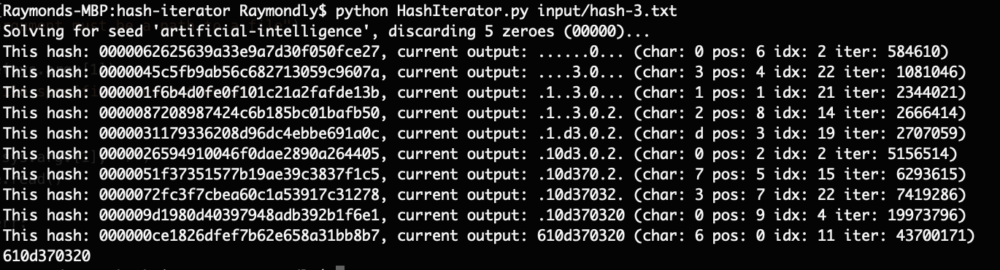

# Hash Iterator

Brute force 
[***hash***](https://en.wikipedia.org/wiki/Hash_function) iterator. This takes 
two inputs, **a salt** and **an integer X**, and generates a 
**10-character string** over the course of a large number of iterations.

## How to test the algorithm

Ensure python is installed.

1. Run the program using the following command replacing the path to the input you want to hash: `python HashIterator.py input/hash-3.txt`
 
1. After running, there should be a new file prefixed with .answer containing the generated hash to 
`input/hash-3.txt.answer`.



## Problem

In each iteration, your code will try to find a single character in the 
10-character string. Each iteration will proceed as follows:
 - Start with the salt, which is an ASCII encoded string
 - Append the iteration number to the salt, starting at 1 to form an input 
string for the hash function
 - Find the hexadecimal representation of the MD5 hash of this input string
(salt + iteration number)
 - If the hash starts with **X** zeros, where **X** is the integer from the 
input, you have a match
 - Once you have a match, you run 2 operations to work out a character of your 
output:
   - Find the character following the **X** zeros. This is the index of the 
match in the output hash string
   - In order to find the character that you put in this index position, find 
the result (**M**) of performing a modulo operation, with the divisor being the 
hash length (32 bits), on your current iteration number. The character 
in position **M** in the hash is the character in your output

This process is repeated until all 10 characters are found. Do not overwrite 
previously found characters.

### Example
**Input:**
```
machine-learning,4
```
**Expected output:**
```
f320e001d1
```
**Logic run-through:**
Your solution starts by appending `'1'` to the salt which gives  
(`"machine-learning1"`), and the hash of this is then 
found: `"e3aaf8288a4bd99222f8960f39e24816"`. This doesn’t start with 4 zeros, 
so the next iteration is conducted.

This continues iterating, and on the 281382nd iteration you hash 
`"machine-learning281382"` and get `"000045eeb68e49d94edb7c6faf93b301"`.
This has the specified 4 zeros at the beginning, and so is used to find a 
character of the output. 281382 modulo 32 is 6, and so the character with 
index 6 of the hash is used (assuming zero indexing), which is `'e'`. The 
number after the zeroes is 4, so the character of the output string to be 
updated is at index 4. Therefore, `'e'` goes in position 4, so the output 
string is `....e.....` (where `.` indicates an unknown character), again 
assuming zero indexing.

After 6854736 iterations, you should have filled all the positions in the 
string, and arrived at the string `f320e001d1`.
